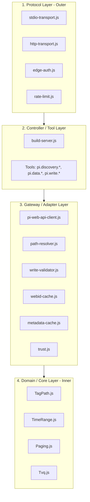

# Architecture Guide - AVEVA PI System MCP Server

This document walkthroughs the Clean Architecture layers, ports, adapters, and flow dynamics of the AVEVA PI System MCP Server.

---

## 1. Architectural Layers

The codebase is structured around Clean Architecture principles, ensuring that business rules remain decoupled from frameworks, transports, and databases.



### 1. Protocol Layer (Outer)
- **Role:** Handles inbound transport framing, serialization, edge authentication, and rate limiting.
- **Components:**
  - `stdio-transport.js`: Standard I/O transport, routing all logs to `stderr` and preventing console pollution.
  - `http-transport.js`: Stateless HTTP server transport supporting multi-replica scaling.
  - `edge-auth.js`: Verifies JWT tokens (JWKS signature verification) or client mTLS certs at the edge.
  - `rate-limit.js`: Memory-bounded token bucket rate limiting.

### 2. Controller / Tool Layer
- **Role:** Exposes tool schemas to the MCP server and orchestrates input arguments to usecase/gateway calls.
- **Components:**
  - `build-server.js`: Compiles the tool registry, mapping MCP tool names to controller handlers.
  - `controllers/tools/`: Single-responsibility controller files per tool (e.g. `get_value.js`, `write_value.js`).

### 3. Gateway / Adapter Layer
- **Role:** Translates abstract gateway ports to specific HTTP requests for the PI Web API.
- **Components:**
  - `pi-web-api-client.js`: Handles HTTP requests using undici, manages retries, backoff, and adaptive cooldown.
  - `path-resolver.js`: Resolves system paths to WebIDs, using batch chains for cache-miss resolution.
  - `write-validator.js`: Validates write value types, digital states, and timestamp boundaries.
  - `webid-cache.js` / `metadata-cache.js`: LRU caches with TTL expiries.

### 4. Domain / Core Layer (Inner)
- **Role:** Models pure domain concepts, values, and invariants with zero I/O or framework dependencies.
- **Components:**
  - `TagPath.js`: Encapsulates PI server/database paths, normalizing backslashes and detecting AF vs Data Archive types.
  - `TimeRange.js`: Parses and normalizes absolute timestamps and relative PI times (e.g., `*-1d`).
  - `Paging.js`: Decodes and encodes base64 query-hash-signed paging tokens.
  - `Tvq.js`: Validates standard time-value-quality objects.

---

## 2. Request Lifecycle Diagram

The sequence below illustrates a path-addressed data read request flow:

```
 MCP Client             Protocol               Controller                Gateway                  PI Web API
     |                     |                       |                        |                         |
     |--- tool call ------>|                       |                        |                         |
     |   (read_recorded)   |--- authenticate() --->|                        |                         |
     |                     |    (edge JWT/cert)    |                        |                         |
     |                     |                       |--- resolveAndRead() -->|                         |
     |                     |                       |                        |-- WebID Cache Hit? -----|
     |                     |                       |                        |   NO: /batch request -->|
     |                     |                       |                        |<-- returns WebID -------|
     |                     |                       |                        |                         |
     |                     |                       |                        |-- GET /streams/webid -->|
     |                     |                       |                        |<-- returns values ------|
     |                     |                       |<-- formatted values ---|                         |
     |                     |<-- tool result -------|                        |                         |
     |<-- formatted JSON --|                       |                        |                         |
```

---

## 3. Core Architectural Rules

1. **Inner Dependency Direction:** Inner layers are completely unaware of outer layers. For example, `TimeRange.js` has no reference to undici, Zod, or MCP.
2. **WebID Cache Seeding:** The client never synthesizes WebID hashes; it only caches WebIDs returned by the PI Web API.
3. **Stateless HTTP Transport:** The HTTP transport acts as a stateless translator. Transports are rebuilt or request bindings are bound dynamically per request to ensure no cross-talk or session leakage.
